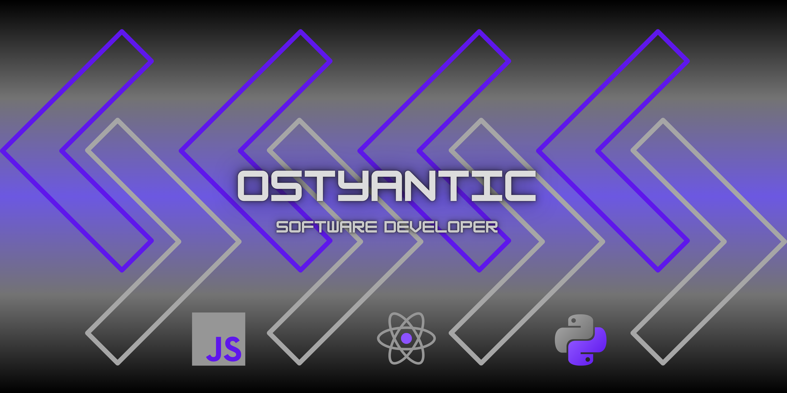

  
  
  

---
<h3> ✏️ About Me </h3>

Hey there! My name is Anthony Lopez, I go by Ostyantic ("Ah-Stee-Ann-Tick") and I am a Software Developer with a background in Customer Care and Order Management. I currently reside in Atlanta, GA and I am a recent graduate of [Code Fellows](https://www.codefellows.org/) where I obtained my certificate in Advanced Software Development with Python. I am also an aspiring video game developer who is passionate in delivering quality gaming experiences. In my off time, there is nothing I enjoy more than just to chill out and play some videos games with friends! Outside of gaming, I also love fitness, spending time with family, and exploring the city of Atlanta!

---
<h3> 🤔 Why I became a Software Developer?</h3>

Coming Soon...

---
<h3> ✨ Professional Competencies</h3>

### Confidence

- Adept at learning
- Rises to overcome challenges
- Posseses excellent communication skills

### Teamwork & Collaboration

- Patient and easy to work with
- A team player who is always willing to pitch in to get a job done
- Open to new ideas and concepts

### Problem Solving & Technical skill

- Able to think outside of the box when solving complex problems
- Excellent critical thinking skills
- Proficient in logic
- Driven in writing quality code that is easy to read

---
<h3>🔭 I’m currently working on ...</h3>

Continuing self learning and re-attempting class labs to practice and maintain coding proficiency. Looking in to potential Udemy courses and revisiting Codecademy.

**Future Projects**:

- Portfolio website
- Viper's Venom Tavern (TBC)

---
<h3> 🎵 Playlists </h3>

Here are some playlists I enjoy listing to depending on the need:

(Playlists coming soon!)

---
<h3> 🎮 Favorite Games</h3>

Coming Soon...

<!--
**Ostyantic/Ostyantic** is a ✨ _special_ ✨ repository because its `README.md` (this file) appears on your GitHub profile.

Here are some ideas to get you started:

- 🔭 I’m currently working on ...
- 🌱 I’m currently learning ...
- 👯 I’m looking to collaborate on ...
- 🤔 I’m looking for help with ...
- 💬 Ask me about ...
- 😄 Pronouns:
- ⚡ Fun fact: ...
-->
